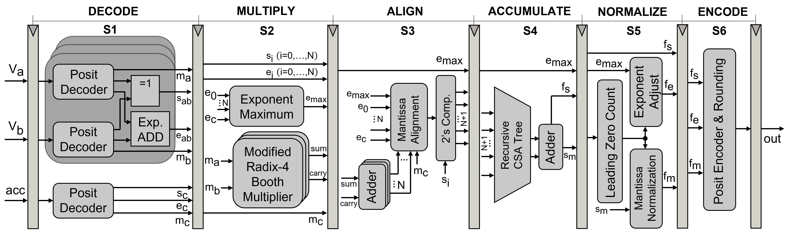

# PDPU
**一种针对深度学习应用的开源Posit点积运算单元**

ISCAS 2023 [ [Paper](https://arxiv.org/abs/2302.01876) | [Slide](docs/PDPU_ISCAS_2023_Slides.pdf) ]

作者：李琼，方超，王中风 @ 南京大学

[ [English](https://github.com/qleenju/PDPU/blob/main/README.md) | 简体中文 ]

## 总览
PDPU在低精度格式下执行向量 $V_a$ 和 $V_b$ 的点积运算，再将点积结果与已有值 $acc$ 累加到更高精度的输出值 $out$，如下式所示：
$$out = acc+V_a\times V_b = acc+a_0\cdot b_0+a_1\cdot b_1+...+a_{N-1}\cdot b_{N-1}$$

**PDPU具有如下特征或贡献：**
- PDPU采用融合和混合精度策略实现基于posit格式的高效点积运算。相比传统的离散架构，PDPU在面积、延迟及功耗上分别降低了43%、64%和70%。
- PDPU内划分为细粒度的6级流水线结构，能最小化关键路径延迟，提高计算效率。
- PDPU高度可配置，能灵活支持各种posit数据类型、点积大小和对齐位宽。

#### 架构
**PDPU的硬件架构如下图所示，其中内嵌了细粒度的6级流水线结构。**



**流水线各个阶段的数据流如下所示：**
- **S1: Decode.** Posit译码器并行提取输入数据的符号、指数与尾数值，随后计算得到 $V_a$ 和 $V_b$ 乘积的符号值 $s_{ab}$ 和尾数值 $e_{ab}$。
- **S2: Multiply.** 在改进的基4布斯乘法器中完成尾数乘法操作，与此同时所有指数在比较器树中比较以得到最大指数 $e_{max}$。
- **S3: Align.** 尾数乘积结果根据其各自对应的指数与最大指数的差值完成对齐操作，随后转换为二进制补码格式。
- **S4: Accumulate.** 对齐后的尾数在一个递归进位保存加法器树中被压缩为和 $sum$ 和进位 $carry$，随后两个值相加得到累积结果绝对值 $s_m$ 和符号 $f_s$。
- **S5: Normalize.** 根据累积结果的前导零计数值完成尾数归一化和指数调整，以确定最终结果的指数值 $f_e$和尾数值 $f_m$。
- **S6: Encode.** Posit编码器执行舍入操作，并根据最终结果的符号、指数和尾数值编码为Posit格式输出 $out$。

## 模块层次
**PDPU基于SystemVerilog实现，其模块层次结构如下所示：**

```
pdpu_top.sv                         # 顶层模块，纯组合实现
pdpu_top_pipelined.sv               # 嵌有细粒度6级流水线的PDPU
├── registers.svh                   # 寄存器头文件
├── pdpu_pkg.sv                     # package库，封装常用的函数等
├── posit_decoder.sv                # posit译码模块，提取输入posit数据的符号、指数及尾数值
│   ├── pdpu_pkg.sv
│   ├── lzc.sv                      # 前导零计数模块
│       └── cf_math_pkg.sv
│   └── barrel_shifter.sv           # 桶式移位器
├── radix4_booth_multiplier.sv      # 改进的基4布斯华莱士乘法器
│   ├── gen_prods.sv                # 基于改进的符号扩展方法生成部分积
│       └── gen_product.sv          # 基于基4布斯编码值生成部分积
│           └── booth_encoder.sv    # 基4布斯编码模块
│   └── csa_tree.sv                 # 递归的进位保存加法器树
│       ├── compressor_3to2.sv      # 3:2压缩器
│           └── fulladder.sv        # 全加器
│       └── compressor_4to2.sv      # 4:2压缩器
│           └── counter_5to3.sv     # 5:3计数器
├── comp_tree.sv                    # 递归的比较器树
│   └── comparator.sv               # 有符号数的比较模块
├── barrel_shifter.sv
├── csa_tree.sv             
│   ├── compressor_3to2.sv
│       └── fulladder.sv
│   └── compressor_4to2.sv
│       └── counter5to3.sv
├── mantissa_norm.sv                # 尾数归一化模块
│   ├── lzc.sv
│       └── cf_math_pkg.sv
│   └── barrel_shifter.sv
├── posit_encoder.sv                # posit编码器，将最终结果编码器为posit格式输出
│   └── pdpu_pkg.sv
└── └── barrel_shifter.sv
```

**得益于高度参数化的设计，PDPU能支持不同posit数据格式、点积大小和对齐位宽的配置。**
- **支持自定义的posit格式：** PDPU支持任意posit输入输出格式，包括不同位宽 $n$和指数位宽 $es$的组合。这也促进了混合精度计算的实现，因为子模块posit译码器和编码能分别适用于不同的格式。
- **支持可变的点积大小：** PDPU支持不同的点积大小 $N$，而不限定于某个特定的值，使得其能满足不同的硬件限制条件。为了实现这种点积大小的伸缩性，部分子模块被并行例化，如架构图所示；与此同时，部分模块递归生成为一种树形结构，如比较器树和进位保存加法器树。
- **支持合适的对齐位宽：** PDPU参数化了尾数对齐的位宽 $W_m$，该宽度可根据输入数据的分布特征和神经网络的精度要求确定。当配置合适的对齐位宽，PDPU能最小化硬件开销，同时保持结果精度，因为对齐过程中移出该位宽的比特将被直接舍弃。

## 引用
如果您认为 PDPU 对您的工作有帮助，请引用我们：
```
@inproceedings{li2023pdpu,
  title={PDPU: An Open-Source Posit Dot-Product Unit for Deep Learning Applications},
  author={Li, Qiong and Fang, Chao and Wang, Zhongfeng},
  booktitle={2023 IEEE International Symposium on Circuits and Systems (ISCAS)},
  year={2023},
  organization={IEEE}
}
```