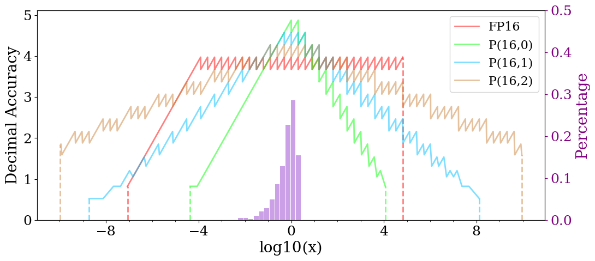

## Tapered accuracy of posit fits the DNN data distribution

### Decimal Accuracy

Decimal accuracy is a metric to measure average precision for various number systems. It can be calculated as follows:

$$decimal\ accuracy=log_{10}(\frac{1}{|log_{10}(x/y)|})=-log_{10}(|log_{10}(\frac{x}{y})|),$$

where $x$, $y$ are the correct value and the computed value when using a rounding system like floats and posits, respectively.

### Getting Started
#### Usage
`gen_exact_values.py`: generate real numbers for posits and floating-point number systems. It includes the following subfunctions:
- `gen_posit_values(Nbits, es, log_range, eps)`: generate real numbers for posit format
- `gen_fp_values(Nbits, ebits, log_range, eps)`: generate real numbers for floating-point format

where $Nbits$ refers to the total bit-width of the data format, and $es$, $ebits$ indicate the exponent size of posit and floating-point format, respectively. $log\underline{\ \ }range$ and $eps$ limit the dynamic range of the output depending on our needs.

`gen_sample_points.py`: generate sample points between the real numbers and calculate their decimal accuracy. It includes the following subfunctions:
- `cal_dec_accuracy(x_pair)`: calculate the decimal accuracy of input pairs
- `interp(exact_data, interval)`: sample $interval$ values (e.g., $interval=1$) uniformly between the logarithmic fields of every two exact values

`main.py`: 

#### Plot results
It can be seen that posits have better decimal accuracy on the majority of calculations, as well as greater dynamic range, demonstrating the excellence of the posit format for DNNs.
The plot result is as follows:
